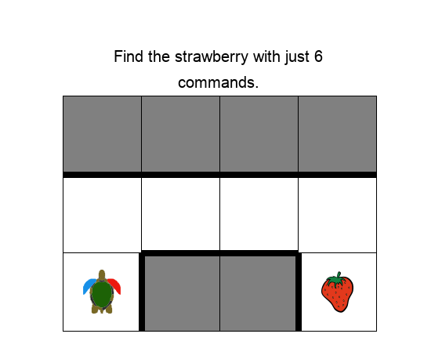

# Task Synthesis for Elementary Visual Programming in XLogoOnline Environment

This repository contains the implementation for the paper [Task Synthesis for Elementary Visual Programming in XLogoOnline Environment](https://arxiv.org/abs/2405.02173).

## Project Structure

The project is organized as follows:
- `scripts`: Contains scripts for task synthesis using various methods.
- `src`
  - `xlogomini`: Utility functions for the XLogoOnline-Mini platform.
  - `xlogominidatagen`: Source code for task synthesis.

## Installation

To install the required dependencies, run:
```bash
pip install -r requirements.txt
```

## Getting Started

### Loading Reference Tasks
To load the reference task and code JSON files:
```python
from src.xlogomini.utils.load_data import load_task_json, load_code_json

task_id = '87'
task_json = load_task_json(task_id)
code_json = load_code_json(task_id)
```

### Visualizing a Task
To visualize a task:
```python
from src.xlogomini.utils.image_conversions import task2image

task_id = '87'
task_json = load_task_json(task_id)
task2image(task_json, show=True, save=False, show_desc=True)
```




### Displaying Code
To display the code for a task:
```python
from src.xlogomini.utils.load_data import load_code_json
from src.xlogomini.components.code.xlogo_code import Code

task_id = '87'
code_json = load_code_json(task_id)
print(Code(code_json))
# Example output:
# fd
# rt
# repeat(3){
#   fd
# }
# rt
# fd
```

### Executing Code
To execute the code within a task:
```python
import src.xlogomini.emulator.executor as executor

task_id = '87'
task_json = load_task_json(task_id)
code_json = load_code_json(task_id)
executor.execute(task_json, code_json)
# Example output: {'crashed': False, 'crashed_msg': None, 'goal_ok': True, 'cons_ok': True, 'err_msg': 'OK'}
```

## Synthesizing Tasks

We provide two techniques for task synthesis: `XLogoSyn` and `RotateFlip`.

### XLogoSyn

To synthesize tasks using `XLogoSyn`, run:
```bash
bash scripts/xlogosyn.sh
```

The following directories will be created:
- `./results/datagen/code`: Generated code JSON files.
- `./results/datagen/goal`: Generated goal JSON files.
- `./results/datagen/task`: Generated task JSON files.
- `./results/datagen/params`: Parameters used for data generation.
- `./results/datagen/image`: Images of the generated tasks.

In the script, you can specify the `--task_id` and the `--diff` parameters. There are three difficulty levels available for tasks: `easy`, `medium`, and `hard`.


> Note: Running the above script may take some time, ranging from a few seconds to several hours, depending on the specific tasks and parameters set in the script. The exact time and parameters used will be saved in a JSON file in the `./results/datagen/params` folder.


### RotateFlip

To generate tasks using `RotateFlip`, run:
```bash
bash scripts/rotateflip.sh
```

The generated data will be stored in the `./results/datagen/image` folder.

## Citation

If you use this code in your research, please cite the following paper:
```
@inproceedings{wen2024xlogosyn,
  author    = {Chao Wen and Ahana Ghosh and Jacqueline Staub and Adish Singla},
  title     = {Task Synthesis for Elementary Visual Programming in XLogoOnline Environment},
  booktitle = {AIED Track on Late Breaking Results},
  year      = {2024}
}
```
